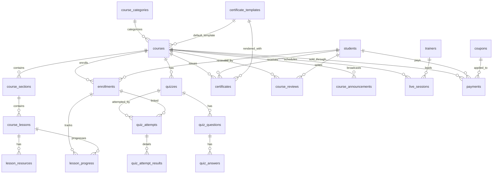

# Brandna Academy - LMS Architecture (Nexus Omni)

This document describes the production-oriented architecture and implementation baseline for the `Brandna Academy` module integrated in Nexus Omni.

## 1) Complete Database Schema

### Core entities
- `course_categories`: category catalog per brand.
- `courses`: draft/published/archived courses with pricing, SEO and metadata.
- `course_sections`: modular course structure.
- `course_lessons`: section lessons (video/pdf/text/external_link).
- `lesson_resources`: downloadable/linked lesson resources.

### Actors and learning lifecycle
- `trainers`: trainer profiles.
- `students`: student profiles.
- `enrollments`: free/paid/manual/bulk registration with lifecycle status.
- `lesson_progress`: viewed/completed tracking with time spent.

### Assessment
- `quizzes`: quiz config (passing score, time, randomization, auto-correction).
- `quiz_questions`: mixed question types.
- `quiz_answers`: answer options and correctness.
- `quiz_attempts`: learner attempts and grading state.
- `quiz_attempt_results`: per-question scoring details.

### Certifications and engagement
- `certificate_templates`: brand-level certificate templates.
- `certificates`: issued certificates with verification token and QR link.
- `course_reviews`: moderated ratings and reviews.
- `course_announcements`: course communication feed.
- `live_sessions`: synchronous session scheduling and attendance.

### Commerce and communication
- `payments`: Stripe/Bank/Manual transaction records, invoices and validation.
- `coupons`: discount codes and usage windows.
- `academy_notifications`: in-app/email event notifications.

### Mandatory technical standards applied
- All LMS tables include:
  - `id`
  - `uuid`
  - `created_by`
  - `updated_by`
  - `softDeletes`
  - `timestamps`
- Multi-brand ready scope through `brand_id` where relevant.

Implemented in:
- `backend/database/migrations/2026_06_24_190000_create_brandna_academy_tables.php`

## 2) ERD

## 3) Laravel Migrations

Implemented:
- Full LMS migration with complete table set and FK/index strategy in:
  - `backend/database/migrations/2026_06_24_190000_create_brandna_academy_tables.php`

## 4) Models and Relationships

Implemented models:
- `CourseCategory`
- `CertificateTemplate`
- `Course`
- `CourseSection`
- `CourseLesson`
- `LessonResource`
- `Trainer`
- `Student`
- `Enrollment`
- `LessonProgress`
- `Quiz`
- `QuizQuestion`
- `QuizAnswer`
- `QuizAttempt`
- `QuizAttemptResult`
- `Certificate`
- `CourseReview`
- `CourseAnnouncement`
- `LiveSession`
- `Payment`
- `Coupon`
- `AcademyNotification`

Shared baseline:
- `AcademyModel` (uuid auto-generation, soft-deletes, creator/updater relations).

Implemented in:
- `backend/app/Models/*` (academy-related files)

## 5) API Endpoints (`/api/academy/...`)

Implemented routes:
- Courses:
  - `GET /api/academy/courses`
  - `POST /api/academy/courses`
  - `GET /api/academy/courses/{id}`
  - `PUT/PATCH /api/academy/courses/{id}`
  - `DELETE /api/academy/courses/{id}`
  - `POST /api/academy/courses/{id}/publish`
  - `POST /api/academy/courses/{id}/archive`
- Students:
  - `GET /api/academy/students`
  - `GET /api/academy/students/{id}`
- Enrollments:
  - `GET /api/academy/enrollments`
  - `POST /api/academy/enrollments`
  - `POST /api/academy/enrollments/bulk`
  - `PATCH /api/academy/enrollments/{id}`
- Reports:
  - `GET /api/academy/reports/dashboard`

Legacy compatibility:
- Existing lessons endpoint kept under:
  - `/api/academy/lessons...`

Implemented in:
- `backend/routes/api.php`
- `backend/app/Http/Controllers/Api/Academy/*`

## 6) Permission Matrix (RBAC)

Academy permission domains added:
- `academy_dashboard.*`
- `academy_courses.*`
- `academy_categories.*`
- `academy_students.*`
- `academy_trainers.*`
- `academy_enrollments.*`
- `academy_progress.*`
- `academy_quizzes.*`
- `academy_certificates.*`
- `academy_reviews.*`
- `academy_announcements.*`
- `academy_live_sessions.*`
- `academy_payments.*`
- `academy_coupons.*`
- `academy_notifications.*`
- `academy_reports.*`

Role mapping added:
- `super_admin`: full academy scope
- `academy_manager`: full operational academy scope
- `trainer`: content/quiz/session/progress operations
- `student`: learning, quizzes, certificates, reviews
- `sales_agent`: enrollment and payment pipeline
- `support_agent`: support visibility and communication

Implemented in:
- `backend/database/seeders/PermissionsSeeder.php`
- `backend/database/seeders/RolesSeeder.php`
- `backend/database/seeders/AcademyRolePermissionsSeeder.php`

## 7) React Page Structure (Target)

Recommended page map (single academy domain):
- `Academy Dashboard`
- `Courses List`
- `Course Details`
- `Course Builder`
- `Students`
- `Enrollments`
- `Quizzes`
- `Certificates`
- `Payments`
- `Reports`
- `Settings`

Current implementation note:
- Existing academy landing screen is still active at:
  - `frontend/src/screens/AcademyScreen.tsx`
- Permission binding updated to:
  - `academy_dashboard.view` in `frontend/src/lib/navPermissions.ts`

## 8) Sidebar Menu Structure (Academy)

Recommended sidebar subtree:
- `Academy`
  - `Dashboard`
  - `Courses`
  - `Course Builder`
  - `Students`
  - `Enrollments`
  - `Quizzes`
  - `Certificates`
  - `Payments`
  - `Reports`
  - `Settings`

For Nexus global nav, keep one top-level `Brandna academy` item and render the academy subtree as internal tabs inside academy screens.

## 9) Dashboard Wireframes (Text)

### Admin Dashboard
- Top KPI cards:
  - Total Students
  - Active Students
  - Courses
  - Revenue
  - Completion Rate
  - Certificates Issued
- Chart row:
  - Monthly Enrollments (line/bar)
  - Monthly Revenue (line/bar)
  - Course Performance (ranked bars)
- Operational row:
  - Upcoming live sessions
  - Pending payment validations
  - Reviews pending moderation

### Student Dashboard
- Current courses with progress bars
- Next live session card
- Latest quiz score
- Available certificates

## 10) Future AI Features

- AI Course Builder: generate section/lesson draft from course brief.
- AI Quiz Authoring: auto-generate questions by lesson content + difficulty.
- AI Tutor Assistant: contextual Q&A on current lesson.
- AI Progress Risk Scoring: identify at-risk students and suggest interventions.
- AI Review Insights: summarize learner sentiment and recurring blockers.
- AI Sales Suggestions: recommend coupons/bundles based on conversion patterns.
- AI Notification Optimization: best channel/timing prediction per learner.
- AI Certificate Fraud Detection: anomaly checks over verification requests.

## Implementation Assets Added

- Migration:
  - `backend/database/migrations/2026_06_24_190000_create_brandna_academy_tables.php`
- Models:
  - `backend/app/Models/AcademyModel.php`
  - `backend/app/Models/*` (academy model set)
- Factories:
  - `backend/database/factories/*` (academy factory set)
- Seeders:
  - `backend/database/seeders/AcademyRolePermissionsSeeder.php`
  - `backend/database/seeders/AcademyDemoSeeder.php`
- API:
  - `backend/app/Http/Controllers/Api/Academy/*`
  - `backend/app/Http/Requests/Api/*Academy*.php`
  - `backend/app/Http/Resources/Api/*Resource.php`
  - `backend/app/Policies/*Policy.php`
  - `backend/routes/api.php`
